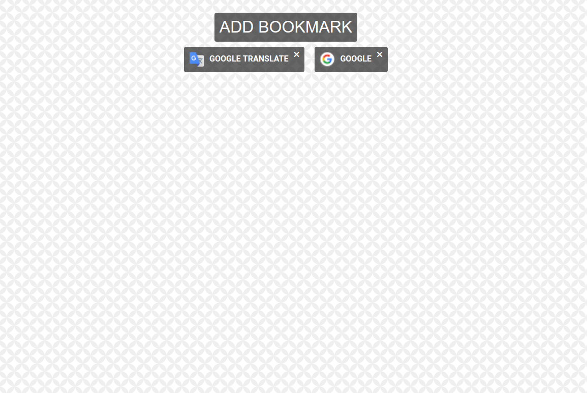
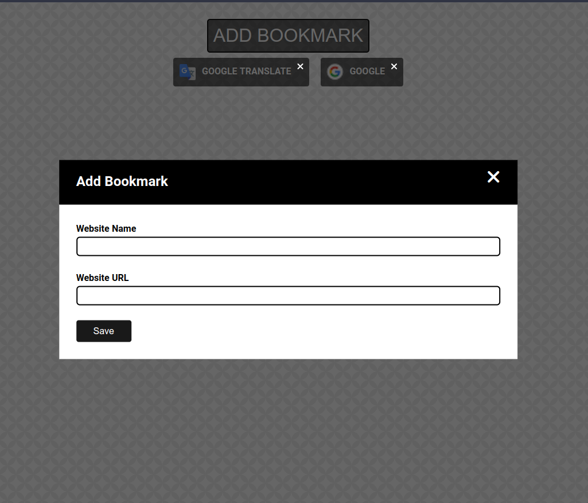

# Bookmark Manager

## Description
Simple offline bookmark manager for startup page for browser.
### Tasks
- [X] Basic styling
- [X] "Add Bookmark" Dialog and button
- [X] List bookmarks
- [X] Retrieve favicon of the link
- [X] Save the bookmarks in local file repopulate the bookmarks in restart
- [X] Closable dialog
- [X] append bookmark to the body with add dialog
- [X] User must be able to remove bookmarks by clicking on times icon

