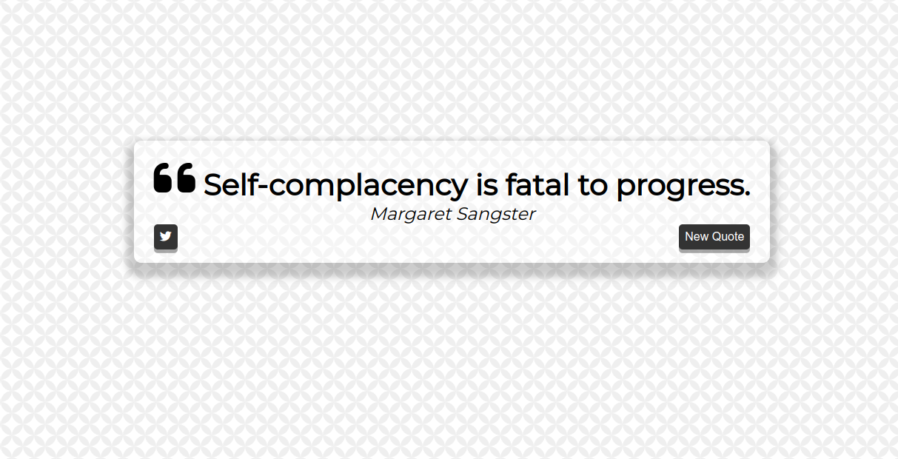

# Quote Generator

## Description
Generate and fetch random quotes from a third-party library.

### Tasks
- [X] Background image
- [X] Third party API class SDK
- [X] Style the quote and message box

### How does it work?
Once you click "New Quote" button fetches quote from a third-party library and displays it by converting the json string to string from the third-party api response.

## Accomplishment
### What did you learn?
- Using twitter API for intent
- Incorperting basic JQuery 
- Practicing basic flex-box and css styling
