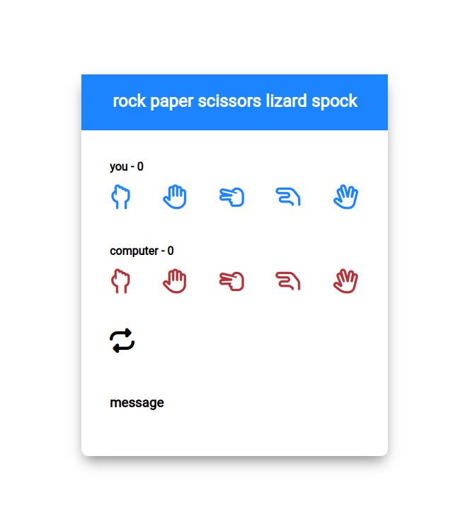

# Spock Rock


## Description
### Tasks
- [X] Game Logic
- [X] Basic style
- [X] Confetti
### Setup
1. Install node js http server
    ```sh
    npm install -g http-server
    ```
2. Change into your working directory, where yoursome.html lives
3. Start your http server by issuing `http-server -c-1`

